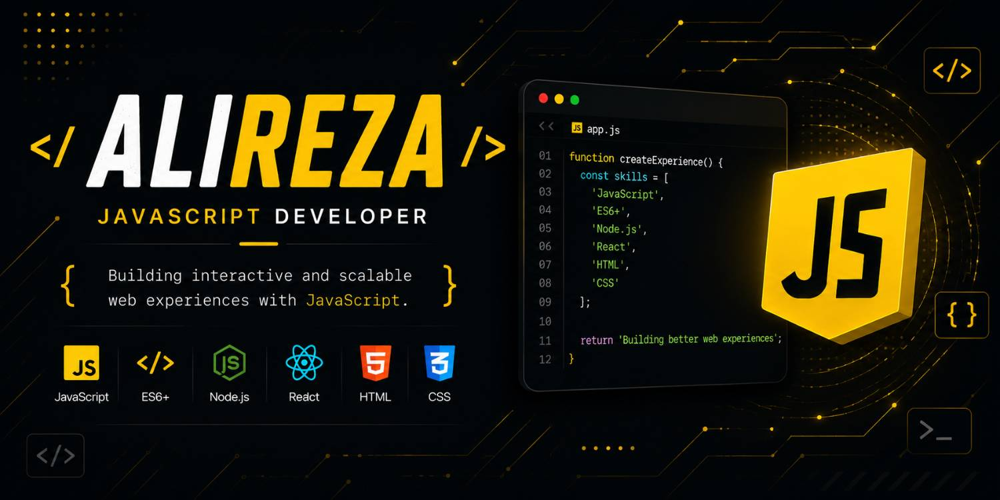

  

<h1 align="center">Hi 👋 I'm Alireza</h1>

<h3 align="center">
Frontend Developer • JavaScript Enthusiast • React Developer
</h3>

Building modern, responsive, and user-friendly web experiences with clean code.

---

# 👨‍💻 About Me

I'm a Frontend Developer passionate about building fast, responsive, and engaging web applications.

I enjoy transforming ideas into beautiful interfaces while focusing on clean code, performance, accessibility, and user experience.

---

# 🚀 Tech Stack

---

# 🎯 Current Focus

* ⚡ Building modern frontend applications
* ⚛️ Mastering React & Next.js
* 🎨 Creating responsive UI/UX
* 🚀 Improving web performance
* 📦 Writing clean and maintainable code

---

# 🌟 Featured Projects

> 🚧 **Coming Soon**

I'm currently working on frontend projects that will be published here soon.

Stay tuned!

---

# 📊 GitHub Analytics

---

# 📈 Contribution Graph

---

# 🌱 Currently Learning

* React Ecosystem
* Next.js
* TypeScript
* Modern CSS
* Web Performance
* UI Animations

---

# 🤝 Connect With Me

📧 **Email:** aliderakhshanfard28@gmail.com

🌐 **Portfolio:** YOUR_PORTFOLIO

💼 **LinkedIn:** YOUR_LINKEDIN

🐙 **GitHub:** https://github.com/Alireza-DevJS

---

<i>"Great interfaces are not only beautiful—they are intuitive, accessible, and built to last."</i>

